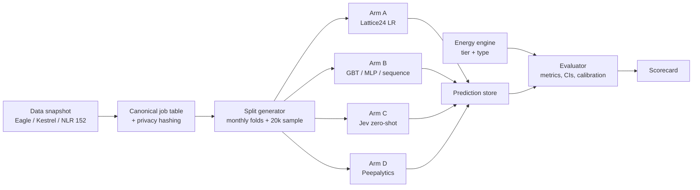

# Compute Efficiency Analytics — Comparative Benchmark Spec

Sep 24, 2026 · @Kareem

## Summary

**Goal: benchmark four approaches to finding compute waste head to head on public Slurm data, then build on whichever wins on energy captured, accuracy, cost and traceability.**

The four arms:

- **A. Lattice24 baseline:** the published four-feature logistic regression.
- **B. Conventional ML:** gradient-boosted trees and neural nets (MLP and a sequence model) on standard features, with no HPC domain rules.
- **C. Jev:** TypeSafe AI's calibrated decision model, used zero-shot on job-history state.
- **D. Peepalytics:** a hybrid system of domain detectors and cross-job features, the best learner from B, a Jev triage layer, and an evidence trail with explanations.

All arms run on the same data, splits, operating points and metrics. The output is a filled-in scorecard and a build decision at week 8.

The question the benchmark answers: *which approach finds the most avoidable energy, most accurately and cheaply, with findings we can trace back to job records?*

## Approaches under comparison

**Each arm represents a distinct way of solving the problem, from the published minimum to our full system.** Arm D deliberately builds on the best of arm B, so D versus B measures the value of domain engineering, and D with and without Jev measures what Jev adds.

| Arm | What it is | Trained on our data? | Tasks it attempts | Cost profile |
| --- | --- | --- | --- | --- |
| A. Lattice24 | Logistic regression on four Elapsed / Timelimit statistics over the user's last 24 jobs | Yes (tiny model) | T1 only | Negligible, CPU |
| B1. Boosted trees | LightGBM (XGBoost as a check) on job request fields + generic user-history aggregates | Yes | T1–T4 | CPU |
| B2. MLP | Same features as B1, standardised, 2–3 dense layers | Yes | T1–T4 | CPU |
| B3. Sequence model | GRU or small transformer over the user's last 32 jobs | Yes | T1–T3 | CPU; GPU optional |
| C. Jev | Zero-shot typed questions over a JSON state of the user's recent jobs | No | T1–T4 (on a sample) | Per-call API; data leaves site |
| D. Peepalytics | Detectors + domain features + best B learner + calibration + Jev triage + evidence and explanations | Yes | T1–T5 | CPU + limited API |

### Arm A: the published baseline

| Item | Published result |
| --- | --- |
| Source | Jardine, Lattice24, [Zenodo report v3](https://zenodo.org/records/21913139) (13 Aug 2026, CC-BY 4.0, not peer-reviewed) |
| Energy share | On NREL Eagle, TIMEOUT jobs were 6.6% of jobs but 45% of job energy |
| Prediction | Next-job timeout AUC 0.93–0.97 on Eagle; 0.918–0.990 (median 0.954) across 29 Kestrel months |
| Energy quantified | 9,370,367 kWh of timed-out jobs on Kestrel (Slurm-measured); 9.9 GWh across both machines |
| Reference code | [lattice24-assess](https://github.com/JJardine919/lattice24-assess) (Apache-2.0) |

**Method.** For each job, take the same user's previous 24 jobs. Compute the mean, standard deviation, range and mean absolute successive difference of Elapsed / Timelimit. Fit logistic regression. We reimplement it clean-room from the published description, untuned, exactly as published.

### Arm B: conventional ML

**What a competent ML team would build without HPC domain knowledge.** Standard feature engineering only:

- Request fields: time limit, CPUs, memory, GPUs, nodes, partition, QOS, submit hour and weekday.
- Generic user history: count, mean and standard deviation of past elapsed ratio, past failure and timeout rates, last outcome.
- B3 instead reads the raw sequence of the user's last 32 jobs as feature vectors.

### Arm C: Jev

Jev is a proprietary model from TypeSafe AI, released in limited early access on 15 Sep 2026 ([Wikipedia](<https://en.wikipedia.org/wiki/Jev_(AI_model)>)). It does not generate text: a request sends a *state* plus typed questions, and it returns typed answers with probabilities ([docs](https://docs.typesafe.ai/introduction)).

| Primitive | Returns | Benchmark question |
| --- | --- | --- |
| Noul | Probability (0–1) a statement is true | T1: "this job will reach its time limit"; T2: "this job will fail" |
| Score | Level on a rubric with probabilities | T3: share of requested wallclock that will be used (0–25%, 25–50%, 50–75%, 75–100%) |
| Choice | Option from a list with probabilities | T4: root cause and recommended action |

**State:** the current job's request plus the user's last 24 jobs (elapsed ratio, state, request), with hashed IDs. Jev is not trained on our data; TypeSafe does not document fine-tuning. Its speed and cost claims (40–200× faster, 40–400× cheaper than frontier LLMs) are self-benchmarked, so we measure our own.

### Arm D: Peepalytics

**The full system: domain rules and features on top of the winning learner, plus the layers the other arms lack.**

1. Six detectors (D1 timeout, D2 restart chains, D3 repeated failure, D4 duplicates, D5 over-request, D6 anomaly and change-point) turn raw records into labelled findings.
2. Domain features added to the best B learner: restart-chain membership, request habit (time limit vs the user's historical p95 elapsed), account-level change-point flags, queue wait, partition load, array position and dependencies.
3. Probability calibration (isotonic) on validation months.
4. Jev triage for findings (T4), run as an ablation: D with Jev vs D without Jev.
5. Evidence trail and explanation layer (T5), described below.

## Public datasets

**Public DOE data covers the MVP and most of the extended vision, including GPU and facility PUE.** All are published by NREL / NLR (National Laboratory of the Rockies) under CC-BY 4.0 unless noted. Keep dataset licence notices with every copy.

| Dataset | What it contains | Use in our plan |
| --- | --- | --- |
| [NREL Eagle supercomputer jobs](https://catalog.data.gov/dataset/nrel-eagle-supercomputer-jobs) (OEDI 5860) | 11M+ anonymised jobs, Nov 2018 – Feb 2023, CSV and Parquet | Primary training and detector set; scale testing |
| [NREL HPC Eagle Jobs Data](https://data.nrel.gov/submissions/152) (NLR 152) | 3 months; wallclock and processors requested vs used, state, queue wait, array position, avg/std power | Lattice24 reproduction; requested-vs-used |
| NLR HPC Kestrel Jobs Data (NLR 302) | Anonymised Slurm jobs 2023–2025, Slurm-measured consumed energy (joules) from Dec 2023 | Measured-energy accounting; replication |
| NLR Eagle Jobs + Additional Energy Metrics | Per-job CPU and GPU energy (TDP-estimated and iLO/Ganglia-measured) and efficiency metrics | Measured vs estimated energy; GPU detectors |
| NLR Eagle Node Power Data | iLO power time series for all Eagle nodes | Idle-node energy; validating job energy attribution |
| NLR Eagle GPU Node Metrics | Ganglia metrics + iLO power, six GPU nodes | GPU underutilisation prototype |
| ESIF Data Center PUE | PUE time series for the NREL data centre | Facility overhead multiplier (job kWh → facility kWh) |

The last five were found via the [data.gov HPC catalogue](https://catalog-old.data.gov/dataset/?tags=hpc); the team should confirm exact URLs, date ranges and licences when downloading. Lattice24's Zenodo record includes a script that range-reads monthly Parquet members from the 697 MB Kestrel archive.

**Gaps public data will not close:** job names and scripts (hashed), cooling and tariff data per job, and any record of what a site did after a flag. The last one matters most; see Energy accounting.

## Benchmark tasks

**Five tasks, from the one Lattice24 published to the ones only a full system can attempt.** Every arm attempts every task it can; a blank is scored N/A, not zero.

| Task | Question | Label source | Primary metric | Secondary | Arms |
| --- | --- | --- | --- | --- | --- |
| T1 Timeout | Will this job hit its time limit? | State = TIMEOUT | Energy captured at 5% flag rate | PR-AUC, AUC, ECE | A, B, C, D |
| T2 Failure | Will this job fail (FAILED, OUT\_OF\_MEMORY, NODE\_FAIL)? | State | Energy captured at 5% flag rate | PR-AUC, ECE | B, C, D |
| T3 Right-sizing | What share of the requested wallclock and cores will be used? | Requested vs used fields | Idle-allocation energy correctly identified | MAE on elapsed ratio | B, C, D |
| T4 Root cause and action | Why did this finding happen, and what should the site do? | 300 hand-labelled findings | Macro-F1 | ECE, accuracy at confidence threshold | B, C, D |
| T5 Traceability | Can every claim be traced to job records? | Findings output + analyst review | % of claims traceable to job IDs | Validator pass rate, analyst rating 1–5 | C, D |

**Energy captured at k%**: flag the top k% of test jobs by predicted risk, then divide the energy of correctly flagged jobs by the total energy of all positive jobs. This is the number a site cares about, so it is the headline metric. AUC is reported for comparison with the published results.

**System metrics, all arms:** training time, inference time and cost per 1M jobs, whether it runs fully offline, and whether any data leaves the site.

## Evaluation protocol

**Same data, same splits, same budget, same metrics: no arm wins on setup.**

**Data and splits**

- Primary: NREL Eagle 11M-job set. Replication: NLR Kestrel (measured energy). Requested-vs-used: NLR 152.
- Forward-chained by month: train on months before *m*, test on month *m*. Report the median and interquartile range across test months.
- No leakage: features for job *n* use only jobs that ended before job *n* was submitted.
- The last six months of each dataset are a locked test set, run once at the end.

**The Jev sample.** Scoring millions of jobs through an API is impractical, so every arm is also scored on the same stratified sample of 20,000 test jobs, stratified by final state and user activity. Arm C is compared to the others only on this sample. A, B and D also report full-set results.

**Fair tuning**

- A runs untuned, as published.
- B and D get the same hyperparameter budget: 50 Optuna trials per model per task, tuned on validation months only.
- C gets the same engineering time as B's feature work (3 days) for question and state design, also tuned on validation months only.
- D may reuse B's best architecture; its only extra inputs are the domain features and detectors listed above.

**Controls and statistics**

- A label-shuffle control for every trained arm; it must score AUC 0.45–0.55.
- Two naive baselines: "repeat the user's last outcome" and "flag the longest time limits".
- 95% bootstrap confidence intervals over test months (over users for the sample). One arm beats another only if the CI of the difference excludes zero.
- Calibration: expected calibration error and reliability diagrams for every probability output, before and after isotonic calibration (Jev reported raw).

**Reproducibility:** fixed seeds, versioned data snapshots, and one shared harness that every arm plugs into.

## Arm D detail: detectors

**Six detectors turn records into labelled findings; the learner ranks and predicts on top of them.** D1 contains the arm A features as a subset, so D can never be worse than A by design, only by overfitting.

| # | Detector | Signal (Slurm fields) | Method | Output |
| --- | --- | --- | --- | --- |
| D1 | Timeout waste + prediction | State = TIMEOUT; Elapsed / Timelimit history | Rule for the finding; best arm B learner with Lattice24 + domain features, calibrated | Timeout energy at stake; P(next job times out) |
| D2 | Restart chains | TIMEOUT followed by same user, same time limit, gap < 2 h; array\_pos; dependency | Sequence linking; later, script-hash matching where available | Chains labelled "intentional checkpoint" vs "repeated failure" |
| D3 | Repeated failure | State in FAILED, NODE\_FAIL, OUT\_OF\_MEMORY; exit codes; runtime before failure | Per user/account/script-hash failure runs; energy burned before failure | Failure loops and their energy |
| D4 | Duplicate workloads | Same user + script hash + resource shape + near-identical runtime within a window | Clustering on job signature | Suspected duplicate submissions |
| D5 | Over-request | processors\_req vs processors\_used; memory and GPU requested vs used; wallclock\_req vs used | Ratio thresholds, then per-account distributions | Idle-allocation energy; right-sizing suggestion |
| D6 | Anomaly and change-point | Per account/partition time series: failure rate, over-request ratio, energy per core-hour | Isolation forest for outlier jobs; change-point detection (e.g. PELT) on series | "What changed": the date, cohort and metric that shifted |

Feature rules and validation for D are the same as for every other arm (see Evaluation protocol).

## Energy accounting and M&V

**Every energy number carries a tier and a type, and "saved" is only ever computed against a measured baseline.**

**Three tiers of job energy**, always labelled in the output:

| Tier | Source | Example data |
| --- | --- | --- |
| Measured | Slurm ConsumedEnergyRaw, iLO node power, GPU power | Kestrel from Dec 2023; Eagle additional energy metrics |
| Modelled | Job's avg power × elapsed, or node power apportioned by allocation | Eagle NLR 152 avg\_power |
| Estimated | TDP × allocated cores/GPUs × elapsed × load factor | Any site without power data |

Facility energy multiplies job energy by PUE for that period when PUE data exists; otherwise it is reported as job energy only.

**Three energy types, never mixed:**

- **Consumed**: what the flagged jobs used.
- **At stake**: the part plausibly avoidable (e.g. idle allocation in D5, full energy of a failure loop in D3, timeout energy net of restart chains in D1/D2). Reported as a range.
- **Saved**: measured reduction after the site acted, against a baseline. Only this may be reported as savings.

**M&V method (to design and validate in phase 3).** Model it on IPMVP-style measurement: agree a baseline period, fix normalising variables, then measure a reporting period after interventions.

```latex
E_{saved} = \sum_{j \in J_{acted}} \left( \hat{E}_{baseline}(j) - E_{actual}(j) \right)
```

Where acted-upon cohorts are users or accounts who received flags and changed behaviour, and the baseline is predicted from their own pre-intervention history, normalised per unit of useful work (e.g. completed core-hours). Stronger evidence comes from a **staggered rollout**: flag half the accounts first and use the rest as a control group.

**Open research questions for the team:** what counts as "useful work" on a shared cluster; whether savings show up as lower kWh or as higher throughput (freed nodes get reused); and who pays the power bill at a typical research centre.

## Arm D detail: evidence, Jev triage and explanation

**These layers are what T4 and T5 test; arms A and B stop at a score.**

**Evidence trail**

- Each finding stores detector and version, score, job IDs covered, fields used, energy tier and input file hash.
- Any number in the report drills down to the rows that produced it; the same input and version always give the same findings.

**Jev triage (T4, ablated)**

- One Jev call per finding: Score for severity and actionability, Choice for root cause (time limit too low; over-requested wallclock; software or data failure; node or hardware fault; intentional checkpoint chain) and for action (right-size / fix job / add checkpointing / review template / no action).
- Confidence gates the result: high goes straight into the ranked report, low goes to a human review queue.
- Jev sees only the finding JSON with hashed IDs and aggregates, never raw job records.
- The same interface can run an LLM with a constrained JSON schema, or an in-house classifier, which is how the "D without Jev" ablation runs.

**Explanation (T5)**

1. The LLM explainer receives the finding JSON plus Jev's answers and writes a summary, evidence, likely cause and action, citing finding IDs.
2. A deterministic validator rejects any number or claim that does not match the finding JSON.
3. An optional Jev Noul check asks whether the text claims a cause the evidence does not support; it runs after the validator, never instead of it.

**Example output** (illustrative, not a real result):

> Account A-17 ran 412 jobs that hit their time limit in March, using an estimated 18.2 MWh. 71% requested 48 h but historically finish in under 10 h when they complete. The pattern began on 4 March, when the account's average requested wallclock rose from 12 h to 48 h. Suggested action: review the account's job template. \[F-0231; 412 jobs\]

## Benchmark harness

**One harness feeds identical inputs to every arm and scores every output the same way.** Stack: Python, Polars or DuckDB over Parquet, scikit-learn, LightGBM / XGBoost, PyTorch for B2 and B3, Optuna for tuning, and the TypeSafe API for arm C.



Every arm implements one interface: `fit(train_jobs)` (a no-op for Jev) and `predict(task, jobs) → predictions`. The evaluator never knows which arm produced a prediction until it writes the scorecard.

**Core records**

```
job         job_id, cluster, user_hash, account_hash, partition, qos, state, exit_code,
            submit/start/end, timelimit_s, elapsed_s, cpus_req/used, mem_req/used,
            gpus_req, nodes, array_pos, dependency?, energy_j,
            energy_tier (measured | modelled | estimated)
run         run_id, arm, arm_version, task, config_hash, data_snapshot, seed,
            fold (train months, test month), tuning_trials
prediction  run_id, job_id | finding_id, score, probability, label_pred,
            latency_ms, cost_usd
result      run_id, metric, value, ci_low, ci_high, n
finding     finding_id, detector, severity, job_ids[], energy_at_stake_kwh [low, high],
            jev_answers[], explanation_text, input_hash   (arm D only)
```

## Scorecard, hypotheses and acceptance criteria

**The deliverable is this table, filled in with confidence intervals.** N/A means the arm cannot attempt the task.

| Metric (test months, median \[95% CI\]) | A | B1 GBT | B2 MLP | B3 Seq | C Jev | D −Jev | D |
| --- | --- | --- | --- | --- | --- | --- | --- |
| T1 energy captured at 5% |  |  |  |  |  |  |  |
| T1 AUC |  |  |  |  |  |  |  |
| T2 energy captured at 5% | N/A |  |  |  |  |  |  |
| T3 idle energy identified | N/A |  |  |  |  |  |  |
| T3 MAE, elapsed ratio | N/A |  |  |  |  |  |  |
| T4 macro-F1 | N/A |  |  | N/A |  |  |  |
| Calibration ECE (T1) |  |  |  |  |  |  |  |
| T5 % claims traceable | N/A | N/A | N/A | N/A |  | N/A |  |
| Cost per 1M jobs (USD) |  |  |  |  |  |  |  |
| Runs fully offline | Yes | Yes | Yes | Yes | No | Yes | Partly |

Column C is scored on the 20,000-job sample; the other columns report both the sample and the full set.

**Hypotheses to test** (predictions, not results):

- **H1.** B1 beats A on T1 energy captured, because it uses request fields A ignores.
- **H2.** B3 does not beat B1 by a meaningful margin on tabular sacct data.
- **H3.** Jev zero-shot trails the trained arms on per-job prediction (T1–T3) but is competitive on T4 judgments, where labelled data is scarce.
- **H4.** D beats the best B arm on T1–T3 energy captured, showing that domain features add value.
- **H5.** D with Jev beats D without Jev on T4 at an acceptable cost per finding.

**Gate 1: reproduction (arm A)**

- [ ] TIMEOUT share on Eagle within ±1 point of 6.6% of jobs and 45% of energy.
- [ ] Kestrel median AUC within ±0.01 of 0.954; label-shuffle control between 0.45 and 0.55.
- [ ] Kestrel timeout energy within ±2% of 9,370,367 kWh over the same 25 months.

**Gate 2: comparison complete**

- [ ] Every arm has run every task it can attempt, on the same folds and the same 20,000-job sample.
- [ ] Every trained arm passes its label-shuffle control and beats both naive baselines.
- [ ] 300 findings labelled for T4, with a second labeller on 50 of them to measure agreement.
- [ ] Cost and latency measured from our own runs, not vendor claims.
- [ ] Scorecard filled with CIs; H1–H5 each marked supported, not supported or inconclusive.
- [ ] Locked test months run once, after all tuning is frozen.

**Gate 3: savings method**

- [ ] Total energy at stake from the winning configuration on Eagle and Kestrel, overlaps removed, in kWh and as a percentage of job energy.
- [ ] M&V method tested on a simulated intervention, recovering the planted saving within ±10%.

**Synthetic data** is used only where public data lacks ground truth (restart chains, change-points, interventions), and every synthetic test is labelled as such.

## Workplan

**Eight weeks from kickoff to a filled scorecard, with a go/no-go after week 1.** Week numbers count from kickoff; dates to be set by the team lead.

| Week | Milestone | Output | Gate |
| --- | --- | --- | --- |
| 1 | Data pulled; canonical table; harness, folds and 20k sample; arm A reproduced; Jev access requested | Reproduction notebook | Gate 1 |
| 2 | Arm B (B1–B3) on T1 and T2 | First scorecard rows |  |
| 3 | T3 targets; arm B on T3; start labelling 300 findings; Jev question design on validation months | Labelling tool; Jev question set |  |
| 4 | Arm C on the 20k sample for T1–T4; arm D detectors and domain features | Arm C results; findings on Eagle |  |
| 5 | Arm D learner + calibration; D with and without Jev; T4 for all arms | Full T1–T4 scorecard |  |
| 6 | Evidence trail and explainer; T5; cost and latency; locked test run | Final scorecard with CIs | Gate 2 |
| 7 | M&V method + simulated-intervention test on the winning configuration | M&V write-up | Gate 3 |
| 8 | Comparison report and 2-page brief | Build recommendation | Decision |

**Team asks**

- [ ] 1 ML engineer (arms A, B and D learners, calibration, evaluator) and 1 data engineer (harness, detectors, energy engine) for 8 weeks; 0.5 of an LLM/app engineer from week 3 for labelling tooling, arm C and the explainer.
- [ ] Two people for about 2 days each to label the 300 findings (with 50 double-labelled).
- [ ] A 64 GB RAM workstation or cloud box; one GPU optional for B3.
- [ ] Jev early-access account and API budget for roughly 20,000 jobs × 3 tasks plus 300 findings; confirm pricing, rate limits and data retention first.
- [ ] Licence check on Apache-2.0 and CC-BY obligations before any external demo.

## Risks, open questions and decision gate

**The main risks are an unfair comparison and a test set worn out by repeated use.**

| Risk | Why it matters | Mitigation |
| --- | --- | --- |
| Unequal effort across arms | The best-tuned arm wins, not the best approach | Equal tuning budgets; engineering time logged per arm |
| Test-set overuse | Repeated peeking inflates every score | Locked final months, run once after tuning is frozen |
| Jev compared only on a sample | Noisier estimates for arm C | Same sample scored by every arm; bootstrap CIs |
| Jev is zero-shot, the others are trained | Not like-for-like | This is the intended question; report it plainly, and test fine-tuning if TypeSafe offers it |
| Jev is early access and self-benchmarked | Pricing, terms or access may change | Arm isolated behind the harness interface; our own cost and latency numbers |
| T4 labels are subjective | Macro-F1 depends on labeller | Double-label 50 findings; report agreement |
| Two DOE clusters may not represent other sectors | Winner may not transfer | Replicate on Kestrel; per-site recalibration later |
| Energy at stake ≠ energy saved | Scores measure risk, not savings | Gate 3 M\&V; rebound effect handled by normalising per unit of useful work |

**Open questions for the team**

- [ ] Can Jev be fine-tuned or deployed privately? If so, add a C2 arm (Jev tuned).
- [ ] Which root-cause taxonomy do HPC operators actually use? Validate the T4 options with one or two research-computing admins.
- [ ] What counts as "useful work" for normalising savings on a shared cluster?

**Decision gate (end of week 8)**

- **D wins on T1–T3 and T5:** build the Peepalytics module on arm D.
- **D does not beat the best B arm:** build on that B arm, keeping D's evidence and explanation layers.
- **D with Jev beats D without Jev on T4:** keep Jev for triage; otherwise use the in-house or LLM classifier behind the same interface.
- **Jev wins T1–T3 outright (unexpected):** evaluate Jev as the primary scorer on a larger sample before committing, given cost and privacy.
- **Gate 1 fails:** pause and review the data and method before any comparison.

## Sources

- [Jardine, "Timed-out HPC jobs are 45% of a cluster's job energy", Zenodo v3](https://zenodo.org/records/21913139)
- [lattice24-assess on GitHub](https://github.com/JJardine919/lattice24-assess)
- [NREL HPC Eagle Jobs Data (NLR 152)](https://data.nrel.gov/submissions/152)
- [NREL Eagle supercomputer jobs (OEDI 5860)](https://catalog.data.gov/dataset/nrel-eagle-supercomputer-jobs)
- [data.gov HPC dataset listing](https://catalog-old.data.gov/dataset/?tags=hpc)
- [Princeton Jobstats](https://github.com/PrincetonUniversity/jobstats/)
- [NAU jobstats](https://github.com/nauhpc/jobstats)
- [Jev (AI model), Wikipedia](<https://en.wikipedia.org/wiki/Jev_(AI_model)>)
- [TypeSafe AI docs: Introduction](https://docs.typesafe.ai/introduction)
